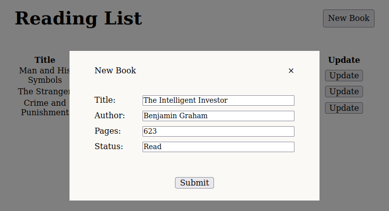
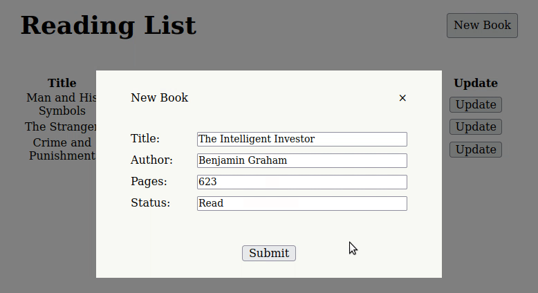

# Library
This is a small library app.
# Description
This is a project that attempts to reinforce topics around objects in javascript. 

The app has a new button that lets you add a book to the list.

You could also update the status of the book if you have read it or not as well as remove the book from the list.

The [project guidelines](https://www.theodinproject.com/paths/full-stack-javascript/courses/javascript/lessons/library) are provided by the odin project. 
